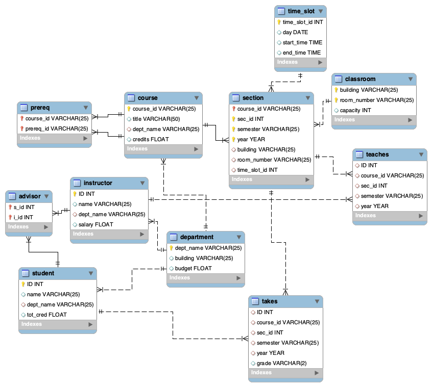

# Design Document

## Database Architecture



## Software
This application is uses the following python modules:

* `Django 4.0.3`
* `mysql-connector-python 8.0.28`

and mySQL version 8.0.28.


## Accounts
Accounts are handled through the built-in django account manager accessible at `http://[hostname]/admin`. Permissions are handled via groups named `admin`, `student`, and `prof`. These groups do not have any django permissions, as accounts are limited by the name of the their joined groups. These limitations are implemented using template if conditions and manual checking in API calls.

Any user attempting to access a resource that they do not have access to will be redirected to a login page. 

## File Structure

The relevant files in the project structure are as follows:

| Path | Purpose |
|:---- |:------- |
| `demo_django` | Default django project containing configuration files | 
| `demo_django/settings.py` | Configuration file |
| `demo_django/urls.py` | top-level urls confiruration |

# TODO: finish


## URL Paths
All functionality is organized via URL paths:
* `myapp/`
  * `login`
  * `controlPanel`
  * `accounts/`
    * `login`
    * `logout`
  * `api/`
    * `F1` through `F6`

Redirects:

* `myapp/` -> `myapp/controlPanel`
* `myapp/login` -> `accounts/login`


## ControlPanel
This is the main hub of this application. First, if the user is not logged in, they will be redirected to a login page. Once the user has logged in, they will be shown all functions that they are permitted to use. This is done using the django template language. Internally, there are `admin.html`, `prof.html`, and `student.html` pages that hold the corresponding available functions. Using simple template language if-statements, we can determine which groups the user belongs to and include each page into the `controlPanel.html` page using template language include statements. 

## API
This section details all API calls used in each required application feature. This API  is http-request based, with all data returned in JSON format. Each API call description consists of:

* A brief description
* Permission group that a user must be a member of to use
* URL location
* Parameters and expected values table
* Example call
* Example response

While each API call will be called from the controlPanel page, which checks for the user's group, each API call also verifies the user's group before returning any data.

### F1 

Returns a list of professors sorted by one of the following criteria: by name, by dept, or by salary.

Permission group: admin

Location: `myapp/api/F1`

| Parameters | Values |
|:----------:|:-------:|
| `orderByType` | `name` or `dept_name` or `salary`|


Example call: GET `localhost:8000/myapp/api/F1?orderByType=dept_name`

Example response:
```
{
  "0": {
    "name": "Breglia", 
    "dept_name": "ANTH", 
    "salary": 10000.0
  }, 
  "1": {
    "name": "Brown", 
    "dept_name": "ART", 
    "salary": 40000.0
  }, 
  "2": {
    "name": "Hoffmann", 
    "dept_name": "ART", 
    "salary": 40000.0
  }, 
  "3": {
    "name": "Jukic", 
    "dept_name": "Business", 
    "salary": 80000.0
  }
}
```

### F2

Returns a table of min/max/average salaries by dept.

Permission group: admin

Location: `myapp/api/F2`

| Parameters | Values |
|:----------:|:-------:|
| None | None |

Example call: GET `localhost:8000/myapp/api/F2`

Example response: 
```
{
  "0": {
    "dept": "ANTH", 
    "min": 10000.0, 
    "max": 10000.0, 
    "avg": 10000.0
  }, 
  "1": {
    "dept": "Applied Math", 
    "min": null, 
    "max": null, 
    "avg": null
  }, 
  "2": {
    "dept": "ART", 
    "min": 40000.0, 
    "max": 40000.0, 
    "avg": 40000.0
  }, 
  "3": {
    "dept": "BIDA", 
    "min": null, 
    "max": null, 
    "avg": null
    } 
  }
```

# Todo: function calls + parameters for each api


