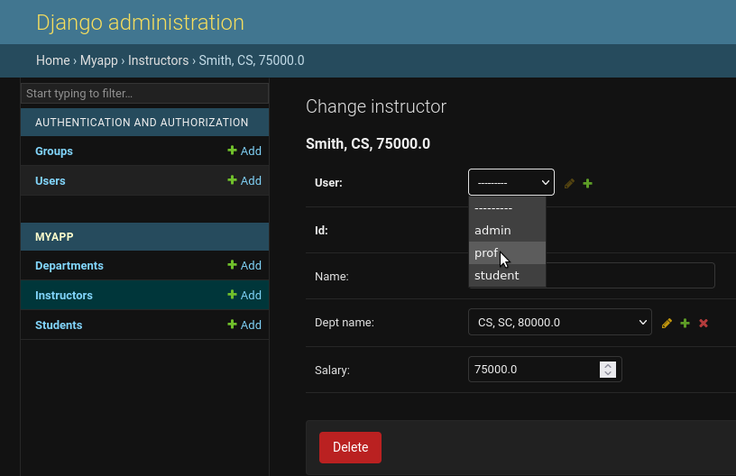

   
# User Document

## Initial Setup

First, create an admin account by running:

`python3 manage.py createsuperuser`

Then, run the server and login to [127.0.0.1:8000/admin](127.0.0.1:8000/admin)

Use the add buttons to add the following groups:

- `admin`
- `prof`
- `student`

Users can now be added and assigned to each group.

## Accounts setup

---

First, navigate to the Instructors / Students section on the left in the MYAPP section.

Next, click one the row that you'd like to assign a user to. Note: you mist click the blue row name, not check the box. 

You should now see a "Change Instructor" / "Change Student" page with a drop-down selection for a "User" field. 

 
 Select the corresponding used you'd like to assign to this instructor / student, and save your changes with the button at the bottom right.

## Logging in

---

After creating the user under the required group, the user can now login using http://127.0.0.1:8000/accounts/login/ 

Here is the login page:

The user can type in the credential of the user account created and this page redirect to the respected control panel.

# The Control Panel - Admin

if you use the credentials to login for an admin account you will be redirected to the Admin section -

After logging in the admin user account, User can do following tasks:
1. Create a list of professors sorted by one of the following criteria chosen by the admin: (1) by name (2) by dept, or (3) by salary
2. Create a table of min/max/average salaries by dept
3. Create a table of professor name, dept, and total number of students taught by the professor in a given semester
   
## Now, You can see the admin section page:

The user can use the check boxes to list the professors ordered by the given attributes. Multiple inputs can be implemented too.
button will execute the task.

## Example 1: The list of professors ordered by name:

## Example 2: The list of professors ordered by all attributes:

## Example 3: The list of all departments and instructors information:

# The Control Panel - Professor

---

if you use the credentials to login for a professor account you will be redirected to the Professor section -

After logging in the professor user account, User can do following tasks:

1. Create the list of course sections and the number of students enrolled in each section that the professor taught in a given semester
2. Create the list of students enrolled in a course section taught by the professor in a given semester

## Now, You can see the Professor section page:

The user can use the drop down list menu to select the Semester,Year,course and section to get the list of classes and number of students along with students list.

## Example 1: The professor selects fall Semester of year 2020 and CS40 courses in section 1 of 2020 

## The Control Panel - Student

if you use the credentials to login for a student account you will be redirected to the student section -

After logging in the student user account, User can do following tasks:
1. Query the list of course sections offered by dept in a given semester and year.

## Now, You can see the Student section page:

The user can use the drop down list menu to select the department,class and year to get the list of course sections.

## Example 1: When user selects CS department for CS141 of fall 2019:

## Example 2: When user selects ART department for AT200 of fall 2019:

